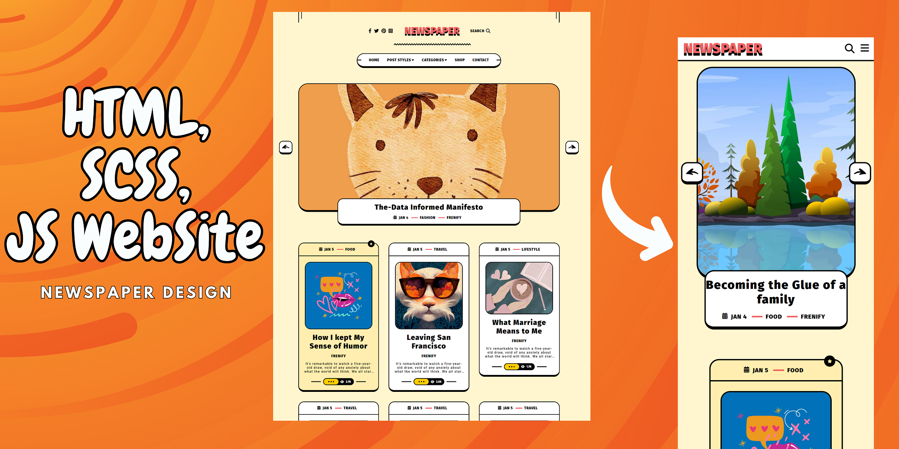
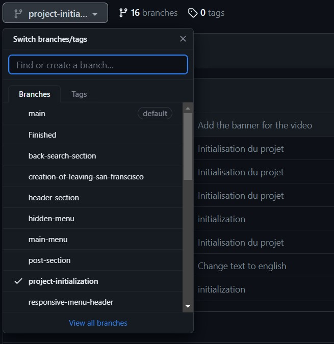

# Introduction

Pour utiliser ce projet, je vous conseille de cliquer sur le bouton code et ensuite télecharger le zip du projet en fonction de l'étape dans laquel vous vous trouvez. Par exemple, si vous venez de commencer la vidéo, aller sur la branche << projet-initialisation>> et telecharger le zip comme dans les images :

# Texte utilisé tout au long de la vidéo

Vous retrouverez ci-dessous les textes pour les différentes parties du sites web.

## Dans la présentation des slides

Slide 1

    Titre du poste : It's Not Just the Passing of a Queen
    Date : JAN 5
    Type 1 : LIFESTYLE
    Type 2 : FRENIFY

Slide 2

    Titre du poste : Becoming the Glue of a family
    Date : JAN 4
    Type 1 : FOOD
    Type 2 : FRENIFY

Slide 3

    Titre du poste : The-Data Informed Manifesto
    Date : JAN 4
    Type 1 : FASHION
    Type 2 : FRENIFY

Slide 4

    Titre du poste : Every Day is a Trip
    Date : JAN 4
    Type 1 : FASHION
    Type 2 : FRENIFY

## Dans la présentation des petits articles

Ca sera le même paragraphe pour tous les posts : It's remarkable to watch a five-year-old draw, void of any anxiety about what the world will think. We all start our lives creatively confident, happy to create and share our work with pride. And then, as we age, our comfort with creative expression declines.

Post 1

    Titre du poste : How I kept My Sense of Humor
    Image : pop.webp
    Date : JAN 5  
    Type 1 : FOOD
    Type 2 : FRENIFY
    Nombre de vues : 2.7K

Post 2

    Titre du poste : Leaving San Francisco
    Image : catGlass.webp
    Date : JAN 5  
    Type 1 : TRAVEL
    Type 2 : FRENIFY
    Nombre de vues : 2.5K

Post 3

    Titre du poste : What Marriage Means to Me
    Image : woman-mariage.webp
    Date : JAN 5  
    Type 1 : LIFESTYLE
    Type 2 : FRENIFY
    Nombre de vues : 1.7K

Post 4

    Titre du poste : Do You Need to Change Yourself
    Image : halloween.webp
    Date : JAN 5  
    Type 1 : TRAVEL
    Type 2 : FRENIFY
    Nombre de vues : 768

Post 5

    Titre du poste : A Love Letter to Los Angeles
    Image : bicycle.webp
    Date : JAN 5  
    Type 1 : TRAVEL
    Type 2 : FRENIFY
    Nombre de vues : 1.1K

Post 6

    Titre du poste : Famous Works of Literature
    Image : interior.webp
    Date : JAN 5  
    Type 1 : TRAVEL
    Type 2 : FRENIFY
    Nombre de vues : 532

Post 7

    Titre du poste : Don't Be in the moment
    Image : pizza.webp
    Date : JAN 5  
    Type 1 : LIFESTYLE
    Type 2 : FRENIFY
    Nombre de vues : 538

Post 8

    Titre du poste : The Greatest Life Hacks
    Image : catWinter.webp
    Date : JAN 5  
    Type 1 : LIFESTYLE
    Type 2 : FRENIFY
    Nombre de vues : 757

## Dans la présentation de l'article de san-franscico

Voici la liste de tous les paragraphes de cet article :

- It's remarkable to watch a five-year-old draw, void of any anxiety about what the world will think. We all start our lives creatively confident, happy to create and share our work with pride. And then, as we age, our comfort with creative expression declines. We’re discouraged by the learning curve of creative skills and tools, by our tendency to compare ourselves to others, and by the harsh opinions of critics. As Picasso famously quipped, “All children are born artists, the problem is to remain an artist as we grow up.” It is a sad irony: As we age, our creative capabilities (and opportunities!) grow as we collect life experiences that inspire us — but our creative confidence shrinks. We are more creatively confident in kindergarten than we are as adults. Correcting this is among the greatest opportunities for the next generation of humankind.

- Well, we're entering an era that changes everything. A few critical technology breakthroughs and fundamentally more accessible platforms are changing everything. From free web-based tools with templates that help conquer the fear of the blank screen to powerful generative artificial intelligence that conjures up anything from a text prompt, expressing yourself creatively no longer requires climbing creativity's notoriously steep learning curve.

- People from communities of color are underrepresented in publishing. Our books make up less than six percent of the titles released each year, and that's despite a century of fighting against the gatekeepers. The results of this systematic exclusion are clear: we are also elided from the national conversation, starting in elementary school. Those who live in this country are trained by textbooks, libraries, classrooms, TV, and cinema to see US life as almost exclusively white.

- Titre : The Death of Creativity's Learning Curve
  
- Image : halloween.webp
  
- Welcome to an era in which the friction between an idea, and creatively expressing that idea, is removed. Whether it is as an image, an essay, an animated story, or even a video, you can simply talk about what you see in your mind’s eye and get immediate visual output. “But that’s not real creativity!” some may exclaim. Until now, “creativity” has conflated both the generation of ideas and the process involved to express those ideas. Is the process of intricately chiseling a beautiful sculpture creative, or is the idea of the sculpture — the image conjured up in the mind’s eye — the truly creative part of an otherwise laborious and tedious process? It’s an age-old argument. Michelangelo, for instance, believed that each stone has a statue inside it and the sculptor discovers it by chipping away. At the same time, the great master employed as many as 13 assistants to help him paint the Sistine Chapel. So, it’s complicated.

- Most artists today can't afford 13 human assistants, but they use other tools to reduce the laborious parts of creativity, including AI-powered shortcuts, component libraries for product designers, templates, and now generative AI. This latest breakthrough has elicited both fanfare and fear because of its ability to conjure up an original piece of media based solely on a text prompt. Conceptually, it’s like a roomful of inexperienced interns who instantly present you with endless renditions of whatever you describe. Most of what they present will be wrong, but you may get some stuff to work with and, occasionally, something novel will catch your eye.

- Of course, behind the scenes, the machine learning engines that drive AI creation were trained using millions of pieces of content from real artists, many of whom never consented to have their work used in that way. To correct this, I anticipate a series of regulations, evolutions in copyright law, new walled gardens and token-gated portfolio experiences, and new compensation models for artists that opt-in and/or allow the use of their style for GenerativeAI purposes. Serious issues to solve and unfortunately, as usual, the availability of such tech preceded these discussions. But here we are, and we need to find the path to sustainability as well as opportunities for both artists and non-artists alike.
